# Turmeric - a spice full of wonders!
Turmeric is truly an astonishing plant with many great properties.  
On this website, some of the benefits shall be presented to win subscribers for a newsletter and social media followers.

The deployed page can be found [here](https://mrmarlonm.github.io/project-turmeric/).

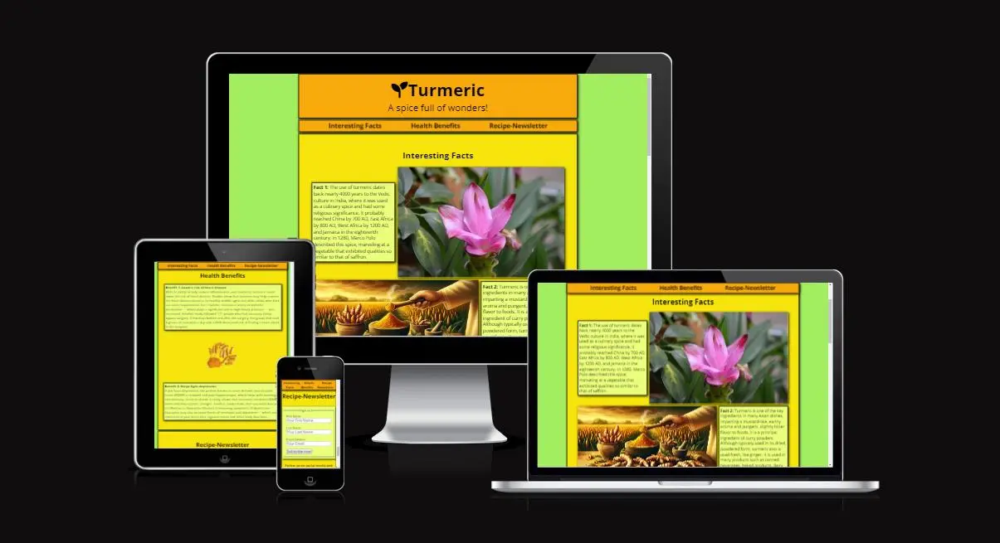

## User Storys
### First-time visitors:
- I want to directly know what the website is about and what information I can get here.
- I want to be able to easily obtain all the information and navigate the side. 
- I want to be able to get further information over links to social media or some kind of registration.

### Returning visitors:
- I want to learn more about the topic.
- I want to get deeper knowledge.
- I want to look up recipes from former newsletters.

### Outlook
To generate operational functionality as soon as possible, the website only focuses on the points described in the user story for first-time visitors.
Later, the website a blog can be added where new medical findings and recipes get posted and are made available to everyone even without subscribing to the newsletter first or following one of the profiles on social media. 

## Features
The site contains some interesting facts about the plant, as well as some supposed medical benefits. Together with some colorful images, it makes people interested in learning more about it. At the end of the page, there will be the option to subscribe to a newsletter or join the creator on social media to learn more.

### Technology used
- To create a general structure [HTML](https://www.w3schools.com/html/) was used
- To add style and responsiveness to the website [CSS](https://www.w3schools.com/html/html_css.asp) was used
    - [Flexbox](https://www.w3schools.com/css/css3_flexbox.asp) was used to make elements responsive
    - [Media queries](https://www.w3schools.com/css/css3_mediaqueries.asp) were used to bring changes to different-sized viewports not possible with flex-box
- To create wireframes the software [Balsamiq](https://balsamiq.com/) was used
- For writing and editing the code [Gitpod](https://www.gitpod.io/) was used
- To host the code and the website [Github](https://github.com/) was used
- For the version control of the website [Git](https://git-scm.com/) was used

### Mobile First vs. Functionality First
Whilst designing the website I found that the mobile version is in essence a simplified version of the desktop version. To use this to my advantage and make the development process easier and faster, I decided to put the desktop version first and scale it down to the mobile version. This way I could greatly use the properties of flex-box to my advantage and only needed to change the rows to columns to implement a mobile edition. 
This made the code needed more concise, which aligns with the specified goal for the webpage to be operational as soon as possible.

### Navigation
Over all device sizes, there will be at the top directly under the header a navigation bar to jump directly to the different sections. 

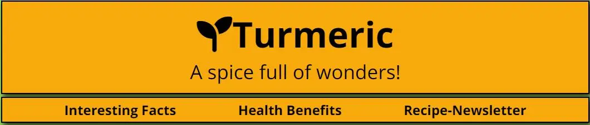

Since the website is built as an endless scroll, the navigation bar sticks to the top of the screen whilst scrolling down, to maintain navigability throughout the page.

On mobile devices with a smaller screen, the navigation bar keeps the same properties as on bigger devices.

Also when you scroll down on a small device, the navigation bar stays at the top.

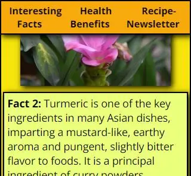

### Section Interesting Facts
As described earlier, the website contains some interesting facts about turmeric. The goal of this section is to make a visitor curious about the plant and start scrolling to learn more. In the first section are three facts provided together with some images.  
On bigger devices the content in the first section alternates between the left and right of the section to make it visually more appealing.

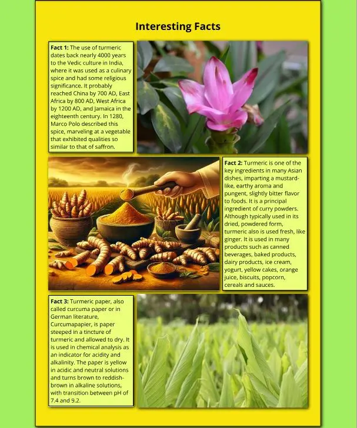

On smaller devices, the paragraphs and images span over the full width of the screen to maintain good readability.

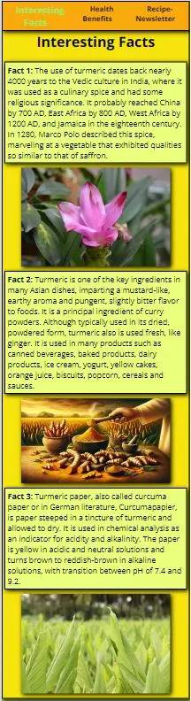

### Section Health Benefits
After getting the visitor engaged with some facts and images, the second section offers some information about the possible health benefits of turmeric. With this in mind, the likelihood of subscribing to the newsletter for delicious recipes with this "lifesaver" is much higher. Also, the engagement with social media to learn more about the health benefits will be higher. 

To keep up a good reading experience for the visitor, the layout changes for mid-sized and small devices in a way, that the elements contain the whole width of the page. 

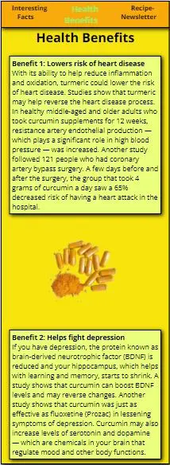

### Section Newsletter-Recipe
The final section of the page contains two images of delicious food containing turmeric to whet the appetite for some recipes.  
Also, there is a signup form for the recipe newsletter, where the visitor can hand over his mail address and name to get the delicious recipes.  
Lastly, there are some links to the affiliated social media pages for more information about turmeric and some recipes.

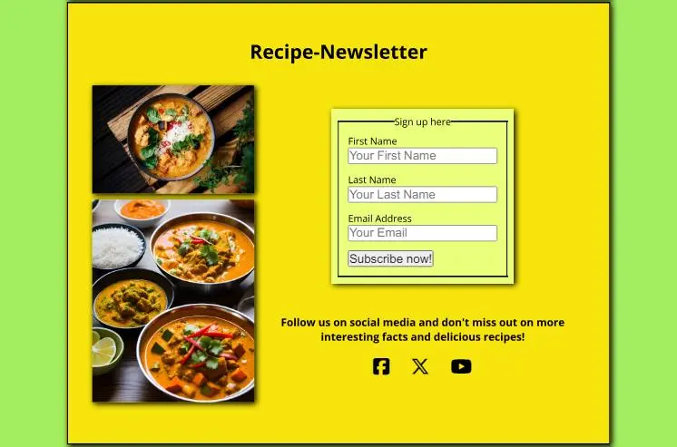

To make this part of the page more mobile-friendly, the bigger image gets hidden on smaller screens and the content will also be presented in columns instead of rows.

### Footer
The footer is kept simple and since it does not contain much information, it doesn't stick to the bottom of the page.  
On desktop devices as well as on mobile devices, the footer contains the name of the author with a link to Git Hub when you click on it. Also, it contains the logo of the page which brings you back to the top of the page when you click on it, as well as some copyright information.

## Design
### Wireframes
Here are the links to the wireframes drawn for the project:  
[Wireframe desktop version 1/2](documentation/wireframe-desktop-1.webp)  
[Wireframe desktop version 2/2](documentation/wireframe-desktop-2.webp)  
[Wireframe mobile version 1/2](documentation/wireframe-mobile-1.webp)  
[Wireframe mobile version 2/2](documentation/wireframe-mobile-2.webp)

### Font
As font was “Open Sans” used and implemented over Google Fonts. It is a simple and classy font with gives a clean and easy look to the website and maintains great readability even on small screens.

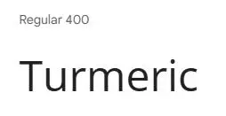
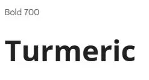

### Colors
For the colors a mixture of orange-yellowish colors together with a light-green background and even lighter green for contrast was used. The colors were taken to fit the theme of the plant and look friendly whilst inducing happiness when visiting the page. 

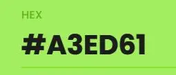

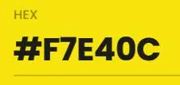
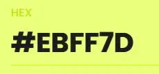

## Testing
### Manual Testing
To ensure the proper functioning of the page, I tested the webpage on Chrome, Firefox, Opera and my Google Pixel Phone. On all three Browsers and the phone, the website behaved as it should and no problems could be found. Further down you find the data of the manual testing.

| Browser | Action | Expected Result | Did it work? | Notes |
| --- | --- | --- | --- | --- |
| Chrome | Nav "Interesting Facts" | Jump to section 1 | Yes | - |
| Chrome | Nav "Health Benefits" | Jump to section 2 | Yes | - |
| Chrome | Nav "Recipe-Newsletter" | Jump to section 3 | Yes | - |
| Chrome | Form "First Name" | Text input possible | Yes | Input is required |
| Chrome | Form "Last Name" | Text input possible | Yes | Input is required |
| Chrome | Form "Email" | Email input possible | Yes | Input in right format required |
it is in right format | 
| Chrome | Form "Subscribe now!" | Redirection to response page | Yes | Only works when all fields are filled in correctly |
| Chrome | Link "Facebook" | Open Facebook in new tab | Yes | - |
| Chrome | Link "X (Twitter)" | Open X in new tab | Yes | - |
| Chrome | Link "Youtube" | Open YouTube in new tab | Yes | - |
| Chrome | Footer "Author" | Open Github in new tab | Yes | - |
| Chrome | Footer "Logo" |  Jump back to top of page | Yes | - |
| Chrome | Response page "Auto redirect" | Redirecton to index.html after 10 seconds | Yes | - |
| Chrome | Response page "Button redirect" | Redirect directly to index.html | Yes | - |
| Chrome | Response page footer "Author" | Open Github in new tab | Yes | - |
| Chrome | Response page footer "Logo" | Jump to index.html | Yes | - |
| Firefox | Nav "Interesting Facts" | Jump to section 1 | Yes | - |
| Firefox | Nav "Health Benefits" | Jump to section 2 | Yes | - |
| Firefox | Nav "Recipe-Newsletter" | Jump to section 3 | Yes | - |
| Firefox | Form "First Name" | Text input possible | Yes | Input required |
| Firefox | Form "Last Name" | Text input possible | Yes | Input required |
| Firefox | Form "Email" | Email input possible | Yes | Input in right format required |
| Firefox | Form "Subscribe now!" | Redirection to response page | Yes | Only works when everything is filled in correctly |
| Firefox | Link "Facebook" | Open Facebook in new tab | Yes | - |
| Firefox | Link "X (Twitter)" | Open X in new tab | Yes | - |
| Firefox | Link "Youtube" | Open YouTube in new tab | Yes | - |
| Firefox | Footer "Author" | Open Github in new tab | Yes | - |
| Firefox | Footer "Logo" |  Jump back to top of page | Yes | - |
| Firefox | Response page "Auto redirect" | Redirecton to index.html after 10 seconds | Yes | - |
| Firefox | Response page "Button redirect" | Redirect directly to index.html | Yes | - |
| Firefox | Response page footer "Author" | Open Github in new tab | Yes | - |
| Firefox | Response page footer "Logo" | Jump to index.html | Yes | - |
| Opera | Nav "Interesting Facts" | Jump to section 1 | Yes | - |
| Opera | Nav "Health Benefits" | Jump to section 2 | Yes | - |
| Opera | Nav "Recipe-Newsletter" | Jump to section 3 | Yes | - |
| Opera | Form "First Name" | Text input possible | Yes | Input required |
| Opera | Form "Last Name" | Text input possible | Yes | Input required |
| Opera | Form "Email" | Email input possible | Yes | Input in right format required |
| Opera | Form "Subscribe now!" | Redirection to response page | Yes | Only works when everything is filled in correctly |
| Opera | Link "Facebook" | Open Facebook in new tab | Yes | - |
| Opera | Link "X (Twitter)" | Open X in new tab | Yes | - |
| Opera | Link "Youtube" | Open YouTube in new tab | Yes | - |
| Opera | Footer "Author" | Open Github in new tab | Yes | - |
| Opera | Footer "Logo" |  Jump back to top of page | Yes | - |
| Opera | Response page "Auto redirect" | Redirecton to index.html after 10 seconds | Yes | - |
| Opera | Response page "Button redirect" | Redirect directly to index.html | Yes | - |
| Opera | Response page footer "Author" | Open Github in new tab | Yes | - |
| Opera | Response page footer "Logo" | Jump to index.html | Yes | - |
| Pixel Phone | Nav "Interesting Facts" | Jump to section 1 | Yes | - |
| Pixel Phone | Nav "Health Benefits" | Jump to section 2 | Yes | - |
| Pixel Phone | Nav "Recipe-Newsletter" | Jump to section 3 | Yes | - |
| Pixel Phone | Form "First Name" | Text input possible | Yes |Input required |
| Pixel Phone | Form "Last Name" | Text input possible | Yes | Input required |
| Pixel Phone | Form "Email" | Email input possible | Yes | Input required |
| Pixel Phone | Form "Subscribe now!" | Redirection to response page | Yes | Only works when everything is filled in correctly |
| Pixel Phone | Link "Facebook" | Open Facebook in new tab | Yes | - |
| Pixel Phone | Link "X (Twitter)" | Open X in new tab | Yes | - |
| Pixel Phone | Link "Youtube" | Open YouTube in new tab | Yes | - |
| Pixel Phone | Footer "Author" | Open Github in new tab | Yes | - |
| Pixel Phone | Footer "Logo" |  Jump back to top of page | Yes | - |
| Pixel Phone | Response page "Auto redirect" | Redirecton to index.html after 10 seconds | Yes | - |
| Pixel Phone | Response page "Button redirect" | Redirect directly to index.html | Yes | - |
| Pixel Phone | Response page footer "Author" | Open Github in new tab | Yes | - |
| Pixel Phone | Response page footer "Logo" | Jump to index.html | Yes | - |

### Validator Testing
- HTML
    - There were no errors returned on the official [W3C validator index.html](https://validator.w3.org/nu/?doc=https%3A%2F%2Fmrmarlonm.github.io%2Fproject-turmeric%2F)
    - There were no errors returned on the official [W3C validator response.html](https://validator.w3.org/nu/?doc=https%3A%2F%2Fmrmarlonm.github.io%2Fproject-turmeric%2Fresponse.html%3Ffirst-name%3DMarlon%26last-name%3DMartynkiewitz%26Email%3Dmarlon.martynkiewitz%2540googlemail.com)
- CSS
    - There were no errors as well when passing the [(Jigsaw) validator](https://jigsaw.w3.org/css-validator/validator?uri=https%3A%2F%2Fmrmarlonm.github.io%2Fproject-turmeric%2F%23health-benefits&profile=css3svg&usermedium=all&warning=1&vextwarning=&lang=en)

### Google Lighthouse
The website has optimal scores on accessibility, SEO and best practices. Especially important is the high accessibility score, since it confirms, that the used colors, fonts and (aria) labels are correctly chosen and work as intended without excluding any people from using the website. 

One note about the slightly worse score of the response page in terms of accessibility, here I used the meta tag http-equiv=”refresh” to automatically bring people back to the main page where the content is. This is normally bad practice since the user has no control over it and loses the position where he where on the page. In this case, there is no reason for this argument, since all the content is on the main page and the visitor gets simply redirected back to it.

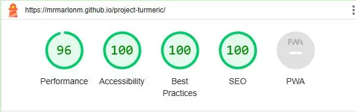
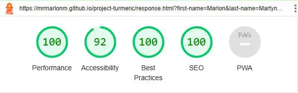

## Deployment

### Deployment to Github Pages
The website was deployed to GitHub pages ([here](https://mrmarlonm.github.io/project-turmeric/)). 

Here are the steps taken:
- In the GitHub repository navigate to Settings
- Under the point "Code and Automation" click on pages
- Find the drop-down menu for the source section and select the Main Branch
- Click on "Save"
- Now the page is deployed and after refreshing the page a link to the page will be provided

### Local Deployment
It is also possible to open a cloned version of the page, For that you need to type the following in your IDE Terminal:
- `git clone https://github.com/MrMarlonM/project-turmeric.git`

## Credits
### Code
For the CSS wildcard selector used to override the default styles of the browser and the HTML implementation of the favicon, I referenced the code of the Love Running walkthrough project. Comments about the code clear up which lines are meant.

### README
To make the readme file as helpful and understandable as possible, I used the [love-running-project](https://github.com/lucyrush/readme-love-running) readme file provided by [Code Institute](https://codeinstitute.net/) and the [animal_shelter](https://github.com/IuliiaKonovalova/animal_shelter) readme file from [Iuliia Konovalova](https://github.com/IuliiaKonovalova) for guidance.

### Tools
The following pages and programs were used in the creation of the webpage:
- [Google Fonts](https://fonts.google.com/) to implement the used Font
- [Dopelycolors](https://colors.dopely.top/) to find fitting colors
- [Balsamiq](https://balsamiq.com/) to create Wireframes for the project
- [Fontawesome](https://fontawesome.com/) for logos
- [favicon.io](https://favicon.io/) to create the favicon
- [freeconvert.com](https://www.freeconvert.com/de/webp-converter) to convert images into webp-format

### Media
All the images used on the website are taken from [Pixabay](https://pixabay.com/). Here are the links to the images:

[turmeric-art](https://pixabay.com/de/illustrations/kurkuma-w%C3%BCrzen-k%C3%BCche-komponente-8397097/)  
[favicon image](https://pixabay.com/de/vectors/kurkuma-w%C3%BCrzen-wurzel-w%C3%BCrze-gesund-2511399/)  
[turmeric pills](https://pixabay.com/de/photos/kurkuma-kurkumin-lebensmittel-3006644/)  
[turmeric-plants](https://pixabay.com/de/photos/kurkuma-bl%C3%A4tter-pflanze-laub-gr%C3%BCn-6638341/)  
[turmeric-flower](https://pixabay.com/de/photos/blume-blume-kurkuma-rosa-farbe-pink-2697872/)  
[curry-and-rice](https://pixabay.com/de/illustrations/ai-generiert-curry-indisch-w%C3%BCrzen-8036273/)  
[curry-one-bowl](https://pixabay.com/de/photos/curry-lebensmittel-gericht-mahlzeit-7249247/)  

### Content
For the facts and medical statements, the following sources were used and directly cited:

#### Interesting facts
[Herbal Medicine: Biomolecular and Clinical Aspects. 2nd edition. Sahdeo Prasad and Bharat B. Aggarwal.](https://www.ncbi.nlm.nih.gov/books/NBK92752/#:~:text=The%20use%20of%20turmeric%20dates,Jamaica%20in%20the%20eighteenth%20century)
[Wikipedia](https://en.wikipedia.org/wiki/Turmeric)

#### Health Benefits
[Cleveland Clinic](https://health.clevelandclinic.org/turmeric-health-benefits)

## Bugs
### Unsolved Bugs
There are no unsolved bugs.

### Solved Bugs
The following bugs were found whilst deploying the website and were corrected:
- The button on the response page to get back to the main page did not have any effect on it. To solve the problem, the styling from the submit button of the form field was copied over to the styling of the button. With that, The background color, font size and hover effects were added and it looks now like other links.

- The footer on the response page sits right under the content and is not pushed down to the bottom of the page. To solve this problem, I added an ID to the body of the response page and set a height of 100vh. Since the main section is already targeted to take up all the extra space through flex-box properties, the footer gets pushed down.

### Mistakes
- Whilst building the website the mobile-first approach was not used, to make the building process simpler. I learned a lot about responsive designs throughout the project and will certainly implement a mobile-first approach in the future.
- The README document was written at the end of the project not whilst and before it. It certainly would have helped with the planning, documentation and implementation process and will be done in future projects.

##  Acknowledgments
- I want to thank [Iuliia Konovalova](https://github.com/IuliiaKonovalova) for her guidance and mentoring throughout the project
- Many thanks to [Code Institute](https://codeinstitute.net/) for providing the learning content
- Also, I want to thank [Kevin Powell](https://www.kevinpowell.co/) for great tutorials on Youtube
