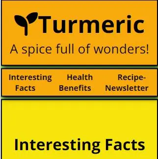
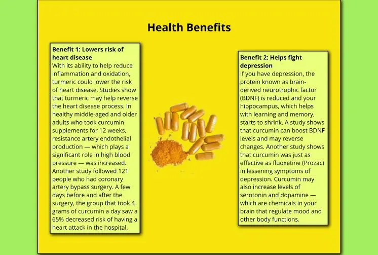

# Turmeric - a spice full of wonders!
Turmeric is truly a astonishing plant with many great properties.  
On this website some of the benefits shall be presented to win subscribers for a newsletter and social media followers.

## User Storys
### First time visitors:
- I want to directly know what the website is about and what information I can get here.
- I want to be able to easily obtain all the information and navigate the side. 
- I want to be able to get further information over links to social media or some kind of registration.

### Returning visitors:
- I want to learn more about the topic.
- I want to get deeper knowledge.
- I want to look up recipes from former newsletters.

### Outlook
To generate operational functionality as soon as possible, the website only focuses on the points described in the user story for the first-time visitors.
Later, the website could get added on a blog where new medical findings and recipes get posted and are made available to everyone even without subscribing to the newsletter first or following one of the profiles on social media. 

## Features
The side contains some interesting facts about the plant, as well as some supposed medical benefits. Together with some colorful images, it makes people interested in learning more about it. At the end of the page there will be the option to subscribe to a newsletter or alternatively join the creator on social media to learn more.

### Mobile First vs. Functionality First
Whilst designing the website I found that the mobile version is in essence a simplified version of the desktop version. To use this to my advantage and make the development process easier and faster, I decided to put the desktop version first and scale it down to the mobile version. This way I could greatly use the properties of flexbox to my advantage and only needed to change the rows to columns to implement a mobile edition. 
This made the code needed shorter and more concise, which aligns with the specified goal for the webpage to be operational as soon as possible.

### Navigation
Over all device sizes there will be at the top directly under the header a navigation bar to jump directly to the different sections. 

Since the website is build as an endless scroll, the navigation bar sticks to the top of the screen whilst scrolling down, to maintain navigability throughout the page.

On mobile devices with a smaller screen, the navigation bar keeps the same properties as on bigger devices.

Also when you sroll down on a small device, the navigation bar stays at the top.

### Section Interesting Facts
As described earlier, the website contains some interesting facts about turmeric. The goal of this section is to make a visitor curious about the plant and start scrolling to learn more. In the first section are three facts provided together with some images.  
On bigger devices the content in the first section alternates between the left and right of the section to make it visually more appealing.

On smaller devices, the paragraphs and images are spanning over the full width of the screen to maintain good readability.

### Section Health Benefits
After getting the visitor engaged with some facts and images, the second section offers some information about the possible health benefits of turmeric. With this in mind, the likelyhood of subscribing to the newsletter for delicious recipes with this "lifesaver" are much higher. Also the engagement with social media to learn more about the health benefits will be higher. 

To keep up a good reading experience for the visitor, the layout changes for mid-sized and small devices in a way, that the elements contain the whole width of the page. 

### Section Newsletter-Recipe
The final section of the page contains two images of delicious food containing turmeric to whet the appetite for some recipes.  
Also there is a sign up form for the recipe newsletter, where the visitor can hand over his mailadress and name to get send the delicious recipes.  
Lastly there are some links to the affiliated social media pages for more informations about turmeric and some recipes.

To make the this part of the page more mobile friendly, the bigger image gets hidden on smaller screens and the content will also be presented in columns instead of rows.

### Footer
The footer is kept really simple and since it does not contain many informations, it doesn't stick to the bottom of the page.  
On desktop devices as well as on mobile devices, the footer contains the name of the author with a link to github when you click on it. Also it contains the logo of the page which brings you back to the top of the page when clicked on it, as well as some copyright information.

## Design
### Font
As font was “Open Sans” used and implemented over Google Fonts. It is a simple and classy font with gives a clean and easy look to the website and maintains great readability even on small screens.

### Colors
For the colors were used a mixture of orange-yellowish colors together with a light-green background and even lighter green for contrast. The colors were taken to fit to the theme of the plant and look friendly whilst induce happiness when visiting the page. 

## Testing
To make sure the website works as intended I tested all the links on the page in the desktop and mobile version. Everything worked as intended and the side displays the content correctly on all formats.

### Validator Testing
- HTML
    - There were no errors returned on the official [W3C validator](https://validator.w3.org/nu/?doc=https%3A%2F%2Fmrmarlonm.github.io%2Fproject-turmeric%2F)
- CSS
    - There were no errors as well when passing the [(Jigsaw) validator](https://jigsaw.w3.org/css-validator/validator?uri=https%3A%2F%2Fmrmarlonm.github.io%2Fproject-turmeric%2F%23health-benefits&profile=css3svg&usermedium=all&warning=1&vextwarning=&lang=en)

### Google Lighthouse
The website has optimal scores on accessibility, SEO and best practices. Especially important is the high accessibility score, since it confirms, that the used colors, fonts and (aria) labels are correctly chosen and work as intended without excluding any people from using the website. 
One note about the slightly worse score of the response page in terms of accessibility, here I used the meta tag http-equiv=”refresh” to automatically bring people back to the main page where the content is. This is normally bad practice since the user has no control over it and loses the position where he where on the page. In this case, there is no reason for this argument, since all the content is on the main page and the visitor gets simply redirected back to it.

## Deployment
The website got deployed to GitHub pages. Following are the steps taken:
- In the GitHub repository navigate to Settings
- Under the point "Code and Automation" click on pages
- Change source to deploy from branch
- Change branch to main and root

## Credits
### Code
For the CSS wildcard selector used to override default styles of the browser and the HTML implementation of the favicon, I referenced code of the Love Running walkthrough project. Comments about the code clear up which lines are meant.

### Technology used
- To create general structure [HTML](https://www.w3schools.com/html/) was used
- To add style and responsiveness to the website [CSS](https://www.w3schools.com/html/html_css.asp) was used
    - [Flexbox](https://www.w3schools.com/css/css3_flexbox.asp) was used to make elements responsive
    - [Media queries](https://www.w3schools.com/css/css3_mediaqueries.asp) were used to bring changes to different sized viewports not possible with flexbox
- To create wireframes the software [Balsamiq](https://balsamiq.com/) was used
- For writing and editing the code [Gitpod](https://www.gitpod.io/) was used
- To host the code and the website [Github](https://github.com/) was used
- For the version control of the website [Git](https://git-scm.com/) was used

### Tools
The following pages and program were used in creation of the webpage:
- [Google Fonts](https://fonts.google.com/) to implement the used Font
- [Dopelycolors](https://colors.dopely.top/) to find fitting colors
- [Balsamiq](https://balsamiq.com/) to create Wireframes for the project
- [Fontawesome](https://fontawesome.com/) for logos
- [favicon.io](https://favicon.io/) to create the favicon
- [freeconvert.com](https://www.freeconvert.com/de/webp-converter) to convert images into webp format

### Media
[turmeric-art](https://pixabay.com/de/illustrations/kurkuma-w%C3%BCrzen-k%C3%BCche-komponente-8397097/)  
[favicon image](https://pixabay.com/de/vectors/kurkuma-w%C3%BCrzen-wurzel-w%C3%BCrze-gesund-2511399/)  
[turmeric pills](https://pixabay.com/de/photos/kurkuma-kurkumin-lebensmittel-3006644/)  
[turmeric-plants](https://pixabay.com/de/photos/kurkuma-bl%C3%A4tter-pflanze-laub-gr%C3%BCn-6638341/)  
[turmeric-flower](https://pixabay.com/de/photos/blume-blume-kurkuma-rosa-farbe-pink-2697872/)  
[curry-and-rice](https://pixabay.com/de/illustrations/ai-generiert-curry-indisch-w%C3%BCrzen-8036273/)  
[curry-one-bowl](https://pixabay.com/de/photos/curry-lebensmittel-gericht-mahlzeit-7249247/)  

### Content
#### Interesting facts
[Herbal Medicine: Biomolecular and Clinical Aspects. 2nd edition. Sahdeo Prasad and Bharat B. Aggarwal.](https://www.ncbi.nlm.nih.gov/books/NBK92752/#:~:text=The%20use%20of%20turmeric%20dates,Jamaica%20in%20the%20eighteenth%20century)
[Wikipedia](https://en.wikipedia.org/wiki/Turmeric)

#### Health Benefits
[Cleveland Clinc](https://health.clevelandclinic.org/turmeric-health-benefits)

## Bugs
### Unsolved Bugs
There are no unsolved bugs.

### Mistakes
- Whilst building the website the mobile first approach was not used, to make the building process simpler. I learned a lot about responsive designs throughout the project and will certainly implement a mobile-first approach in the future.
- The README document got written at the end of the project not whilst and before it. It certainly would have helped with the planning, documentation and implementation process and will be done in future projects.
    - Adding to this, there were no major bugs to report and there is no overview afterwards of smaller problems, because of the mentioned point.

## Acknowledgements
- I want to thank [Iuliia Konovalova](https://github.com/IuliiaKonovalova) for her guidance and mentoring throughout the project
- Many thanks to [Code Institute](https://codeinstitute.net/) for providing the learning content
- Also I want to thank [Kevin Powell](https://www.kevinpowell.co/) for great tutorials on Youtube