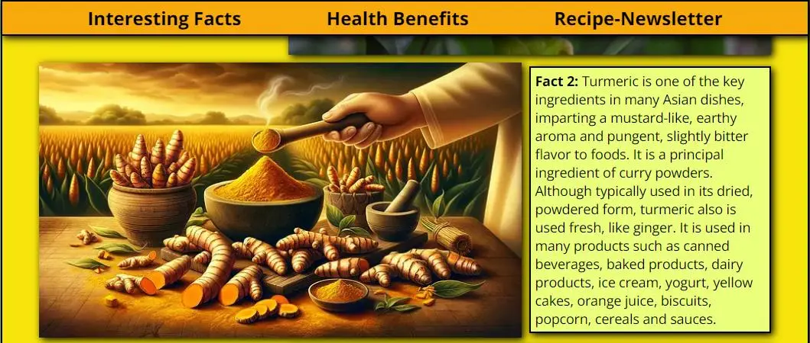

# Turmeric - a spice full of wonders!

Turmeric is truly a astonishing plant with many great properties.  
On this website some of the benefits shall be presented to win subscribers for a newsletter and social media followers.

## Features
The side contains some interesting facts about the plant, as well as some supposed medical benefits. Together with some colorful images, it makes people interested in learning more about it. At the end of the page there will be the option to subscribe to a newsletter or alternatively join the creator on social media to learn more.

### Navigation
Over all device sizes there will be at the top directly under the header a navigation bar to jump directly to the different sections. 

Since the website is build as an endless scroll, the navigation bar sticks to the top of the screen whilst scrolling down, to maintain navigability throughout the page.

On mobile devices with a smaller screen, the navigation bar keeps the same properties as on bigger devices.

Also when you sroll down on a small device, the navigation bar stays at the top.

### Section Interesting Facts

As described earlier, the website contains some interesting facts about turmeric. The goal of this section is to make a visitor curious about the plant and start scrolling to learn more. In the first section are three facts provided together with some images.  
On bigger devices the content in the first section alternates between the left and right of the section to make it visually more appealing.

On smaller devices, the paragraphs and images are spanning over the full width of the screen to maintain good readability.

## Credits
### Media
[turmeric-art](https://pixabay.com/de/illustrations/kurkuma-w%C3%BCrzen-k%C3%BCche-komponente-8397097/)  
[favicon image](https://pixabay.com/de/vectors/kurkuma-w%C3%BCrzen-wurzel-w%C3%BCrze-gesund-2511399/)  
[turmeric pills](https://pixabay.com/de/photos/kurkuma-kurkumin-lebensmittel-3006644/)  
[turmeric-plants](https://pixabay.com/de/photos/kurkuma-bl%C3%A4tter-pflanze-laub-gr%C3%BCn-6638341/)  
[turmeric-flower](https://pixabay.com/de/photos/blume-blume-kurkuma-rosa-farbe-pink-2697872/)  
[curry-and-rice](https://pixabay.com/de/illustrations/ai-generiert-curry-indisch-w%C3%BCrzen-8036273/)  
[curry-one-bowl](https://pixabay.com/de/photos/curry-lebensmittel-gericht-mahlzeit-7249247/)  

### Content
#### Interesting facts
[Herbal Medicine: Biomolecular and Clinical Aspects. 2nd edition. Sahdeo Prasad and Bharat B. Aggarwal.](https://www.ncbi.nlm.nih.gov/books/NBK92752/#:~:text=The%20use%20of%20turmeric%20dates,Jamaica%20in%20the%20eighteenth%20century)
[Wikipedia](https://en.wikipedia.org/wiki/Turmeric)

#### Health Benefits
[Cleveland Clinc](https://health.clevelandclinic.org/turmeric-health-benefits)